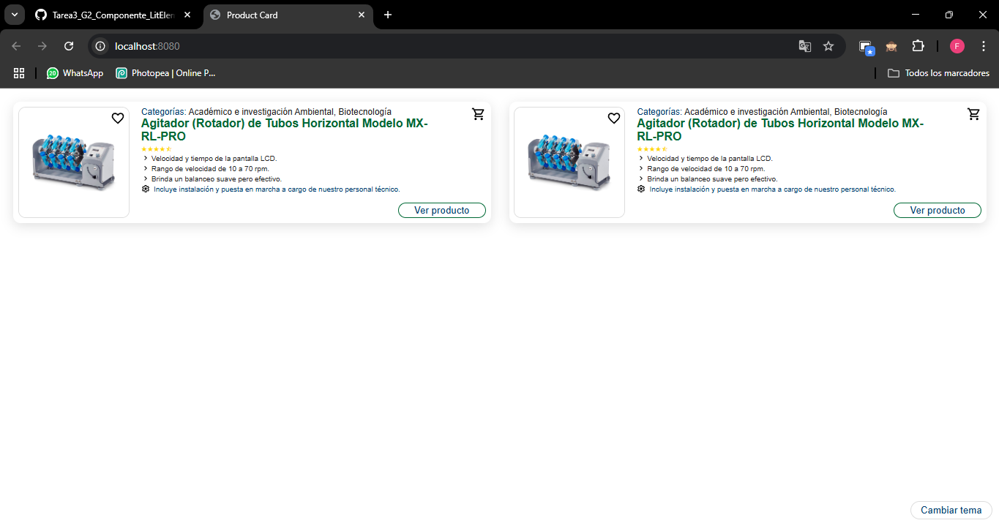
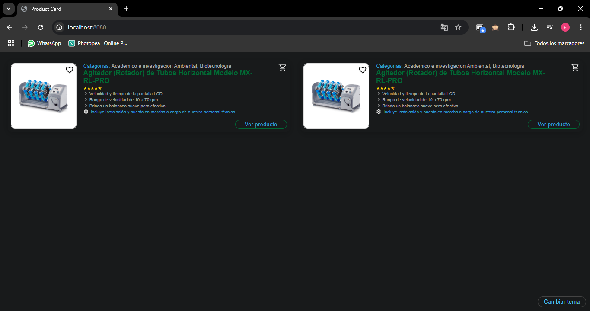
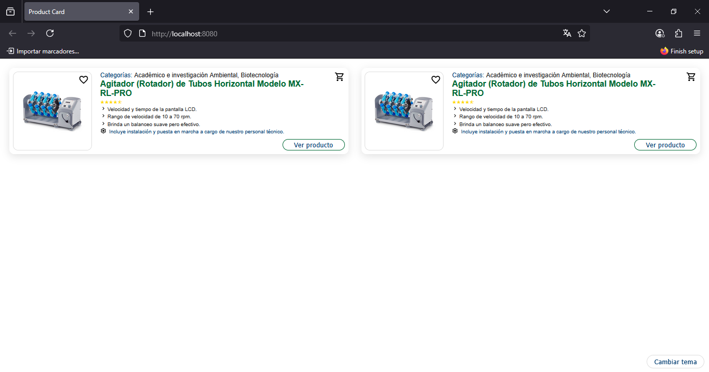
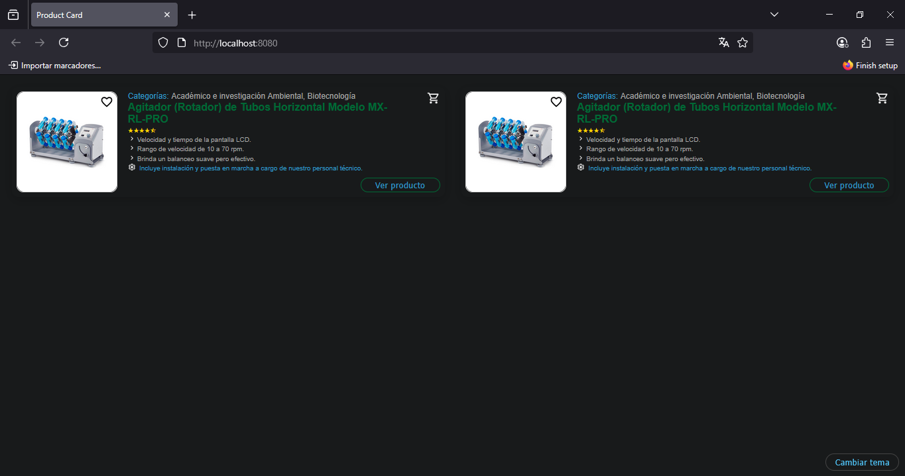
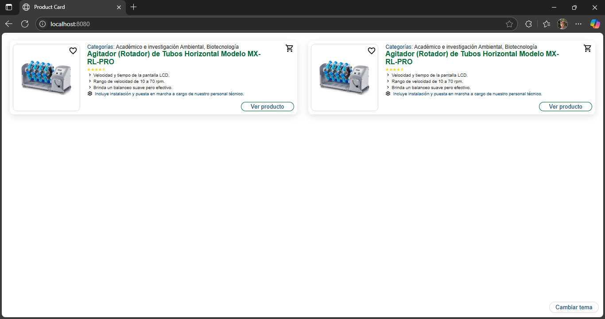
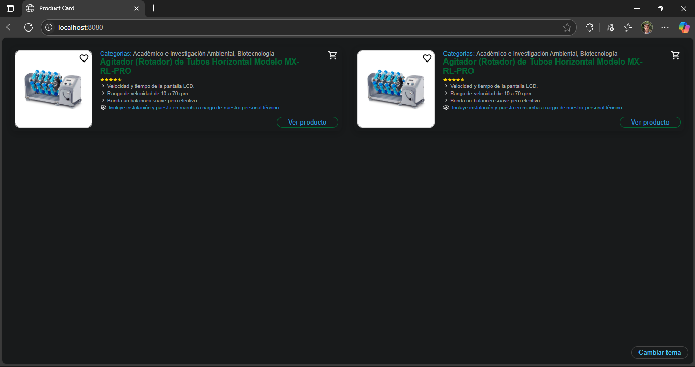
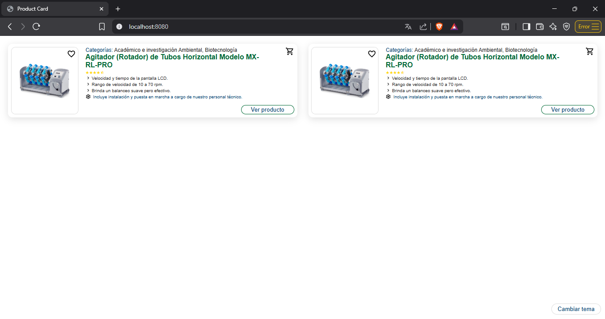
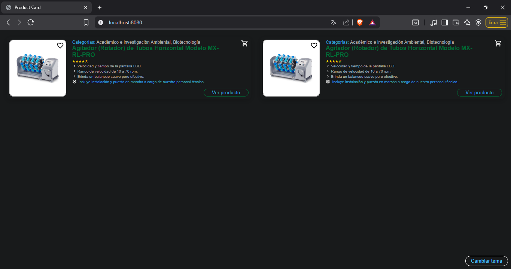

# Componente de Producto `<product-card>`
Componente web personalizado basado en LitElement para mostrar una tarjeta de producto con imagen, precio, categorias, valoracion, opciones de favoritos y detalles emergentes.

## Objetivo del componente
El `<product-card>` proporciona una forma visual y reutilizable para mostrar informacion de productos en tiendas, catalogos o aplicaciones e-commerce. Incluye integracion de estilos dinamicos con soporte de modo claro/oscuro y animaciones.

## Ejemplo de uso en HTML
Para que te funcione asegurate de haber registrado el componente con JS importando product-card.js.
```html
<product-card
  image="producto.jpg"
  title="Camiseta Deportiva"
  categories="Ropa,Deporte"
  tags="hombre,verano"
  rating="4"
  price="$19.99"
  extras="Envío gratis"
  specifications="Talla M, poliéster"
  theme="dark"
  size="small">
</product-card>
```
## Atributos soportados

| Atributo         | Tipo     | Descripcion                                       |
| ---------------- | -------- | ------------------------------------------------- |
| `image`          | `string` | URL de la imagen del producto                   |
| `title`          | `string` | Nombre del producto                            |
| `categories`     | `string` | Lista separada por comas de categorías         |
| `tags`           | `string` | Lista separada por comas de etiquetas          |
| `rating`         | `number` | Valoracion numerica del producto              |
| `price`          | `string` | Precio del producto                            |
| `extras`         | `string` | Texto adicional como promociones o envios       |
| `specifications` | `string` | Especificaciones tecnicas o descripcion corta   |
| `theme`          | `string` | `light` (por defecto) o `dark`                  |
| `size`           | `string` | Tamaño visual: `small`, `default` (sin atributo) |

## Tester y Compatibilidad

Uso del componente en el navegador


Probado correctamente en los siguientes navegadores tanto en modo claro como oscuro:

- Google Chrome




- Firefox




- Edge




- Brave






# Reporte Tecnico (Markdown)

## Estilos dinamicos con CSS Variables

Este componente utiliza CSS Variables para modificar colores y estilos en funcion de atributos (`theme`, `size`) o del entorno visual.

```css
:host {
  --color-bg: #fff;
  --color-text: #222;
  ...
}
:host([theme="dark"]) {
  --color-bg: #181a1b;
  --color-text:#a8a8a8;
  ...
}
```
El cambio de tema ocurre dinamicamente usando el atributo theme="dark", sin recargar ni aplicar clases externas.

## Estilos Estaticos vs Dinamicos en Web Components

| Estilos Estaticos                      | Estilos Dinamicos con Variables CSS           |
| -------------------------------------- | --------------------------------------------- |
| Codificados dentro del `css\`\`\`      | Definidos con `--variables`                   |
| Poco flexibles ante cambios            | Permiten temas (modo claro/oscuro) facilmente |
| No responden a atributos o contexto    | Adaptables con `:host([atributo])`            |
| Dificiles de sobrescribir externamente | Se pueden modificar desde el exterior         |

## Ventajas de CSS Variables en Aplicaciones Reales
Usar CSS Variables es util cuando se quiere manejar temas como modo claro y oscuro sin tener que duplicar todo el CSS. Solo se cambian los valores de las variables, todo el estilo del componente se adapta sin modificar el JavaScript o crear mas clases.

Tambien ayudan a que todos los componentes tengan el mismo estilo visual. Por ejemplo si se define un color o tamaño como variable, todos los componentes pueden usarlo, lo que hace que la app se vea mas uniforme y profesional.

Otra ventaja es que facilita el mantenimiento. Si se necesita cambiar un color que se usa en varios lugares, solo se cambia la variable una vez y listo. No hay que buscar y reemplazar en cada archivo, lo cual ahorra tiempo y evita errores.